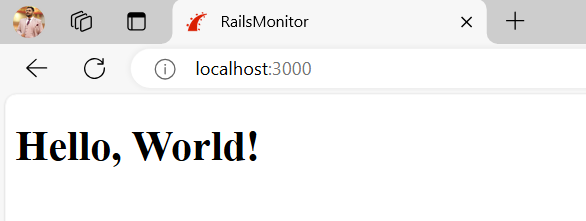
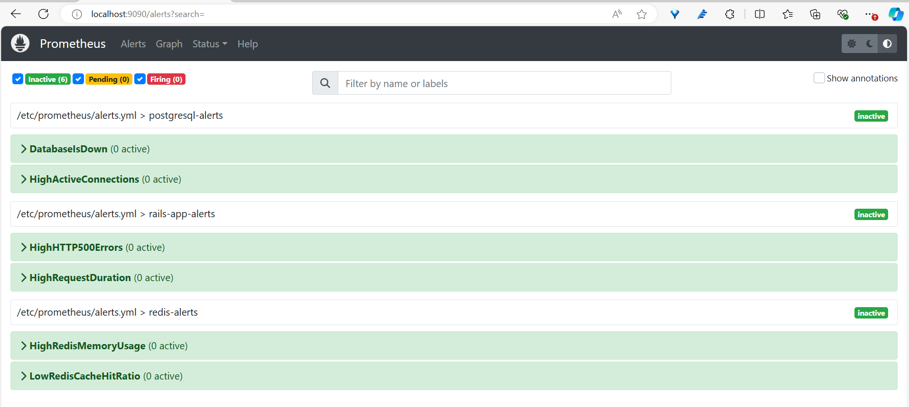
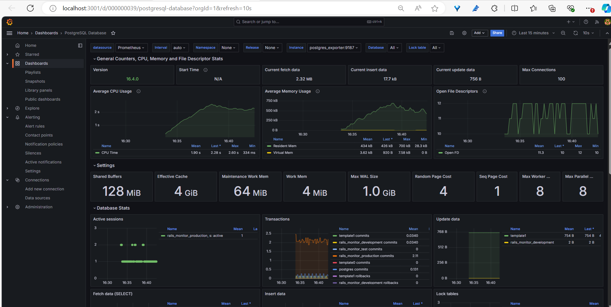
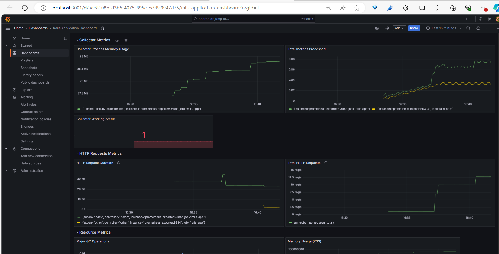

# RailsMonitor
RailsMonitor is a "Hello World" Rails application connected to PostgreSQL and Redis, with integrated monitoring solutions. This setup ensures comprehensive tracking of the application's performance, reliability, and resource usage.



## Prerequisites
- Ubuntu Os (18.04+)
- Docker (version 27.2.0+)
- Docker Compose (version 1.29+)


## Setup Instructions

1. **Clone the repository**:
   ```bash
   git clone https://github.com/mohsin996/RailsMonitor.git
   cd RailsMonitor
   ```
2. **Run the setup script to start the application**:
   ```bash
   chmod +x setup.sh
   ./setup.sh
   ```
3. **Access the application**:
   - Rails Web app: http://localhost:3000
   - Prometheus: http://localhost:9090
   - Grafana: http://localhost:3001/login (Username: admin, Password: admin)

## Repository Overview
Here's a quick look at the key files and directories in the repository:
   ```bash
    #I've only marked the sections where I made the changes.
    RailsMonitor.git
         ├── Dockerfile
         ├── LICENSE
         ├── README.md
         ├── docker-compose.yml
         ├── grafana
         │   ├── dashboards
         │   │   ├── postgres-dashboard.json
         │   │   ├── rails_dashboard.json
         │   │   └── redis-dashboard.json
         │   └── provisioning
         │       ├── dashboards
         │       │   └── dashboards.yml
         │       └── datasources
         │           └── datasource.yml
         ├── prometheus
         │   ├── alerts.yml
         │   └── prometheus.yml
         ├── rails_application
         │   ├── Gemfile
         │   ├── Gemfile.lock
         │   ├── app
         │   │   ├── controllers
         │   │   │   └── home_controller.rb
         │   │   └── views
         │   │       ├── home
         │   │       │   └── index.html.erb
         │   ├── bin
         │   │   ├── docker-entrypoint
         │   ├── config
         │   │   ├── application.rb
         │   │   ├── database.yml
         │   │   ├── initializers
         │   │   │   └── prometheus.rb
         ├── setup.sh
         └── terraform
            ├── README.md
            ├── main.tf
            ├── provision.sh
            └── provision.sh.b64
```
- **docker-compose.yml** - Orchestrates the application services: PostgreSQL, PostgreSQL Exporter, Redis, Redis Exporter, Rails Web App, Prometheus, and Grafana.
- **Dockerfile** - Builds a production-grade Rails application image.
- **Gemfile** - Includes essential gems such as redis and prometheus_exporter.
- **prometheus.rb** - Configures the Rails Prometheus Exporter.
- **Grafana** -   Contains Grafana dashboards and datasource configurations.
- **Prometheus** -   Contains Prometheus and Alerting configurations
- **prometheus.yml** - Defines Prometheus scrape configurations for the services.
- **alerts.yml** - Defines Prometheus Alert configurations for the services.
- **terraform** Contains Terraform configuration files and provisioning scripts. (If there is a requirement for a VM)
  - **main.tf**: Terraform configuration file used for provisioning infrastructure resources. It includes:
    - **Resource Group (RG)**: A container that holds related resources for the application.
    - **Virtual Network (VNet)**: Defines the network infrastructure.
    - **Subnet**: Specifies a subnet within the VNet.
    - **Network Interface Card (NIC)**: Provides network connectivity for the VM.
    - **Ubuntu VM**: Virtual Machine running Ubuntu, where the RailsMonitor application will be deployed.
    - **Public IP**: Allows external access to the VM.
    - **Network Security Group (NSG)**: Controls access to the VM, permitting traffic to the application, Grafana, and Prometheus.
  - **provision.sh**: Shell script used for bootstrapping the server. It performs the following actions:
    - Clones the repository from GitHub.
    - Runs the setup script to initialize and configure the application.
  - **provision.sh.b64**: Base64 encoded version of `provision.sh` for secure handling. This encoded file can be decoded and executed as part of the provisioning process to ensure sensitive information is managed securely.


## Metrics Explanation and Monitoring

### Key Service Metrics

**RailsMonitor** integrates critical monitoring metrics for the Rails application, PostgreSQL, and Redis:

#### Rails Application Metrics (via Prometheus Exporter):
- **Memory Usage (RSS):** Alerts if memory usage exceeds 75%.
- **HTTP Request Duration:** Alerts if 99th percentile of HTTP request duration exceeds 0.5 seconds for the last 5 minutes.
- **Toal HTTP Requests:** Alerts if there are High HTTP500 Errors.
- **HEAP Slots (Live and Free):** Monitors HEAP slots to detect potential issues.
- **Major GC Operations:** Alerts if the frequency of major garbage collection operations exceeds normal thresholds.

#### PostgreSQL Metrics (via PostgreSQL Exporter):
- **CPU Usage:** Alerts if CPU usage exceeds 80%.
- **Memory Usage:** Alerts if memory usage exceeds 75%.
- **Transactions Per Second (TPS):** Alerts on both high and low transaction thresholds.
- **Cache Hit Ratio:** Alerts if the cache hit ratio drops below 90%.
- **Stat Activity Counts**: Alerts if there are high number of active PostgreSQL connections

#### Redis Metrics (via Redis Exporter):
- **Memory Usage:** Alerts if Redis memory usage exceeds 80%.
- **Connected Clients:** Alerts if the number of connected clients exceeds 90% of the maximum allowed connections.
- **Cache Hits/Misses:** Monitors cache efficiency with alerts if the hit ratio falls below 90%.


### Monitoring and Alerting

The Prometheus setup in RailsMonitor is configured to scrape metrics from the Rails application, PostgreSQL, and Redis services. These metrics are visualized in Grafana dashboards and can trigger alerts to maintain application health and reliability.

**Example Alerts:**
- **Rails Application:** Alerts for memory usage exceeding 75%, HTTP request duration breaches,HTTP 500 requests and other critical performance metrics.
- **PostgreSQL:** Alerts for CPU usage exceeding 80%, low cache hit ratio, Stat Activity Count, and other essential performance indicators.
- **Redis:** Alerts for memory usage exceeding 80%, high number of connected clients, and cache efficiency issues.



**Example Grafana Dashboards:**

- **Postgres dashboard:** Postgres dashboard was adapted from [this source](https://grafana.com/grafana/dashboards/9628-postgresql-database/)
   

- **Rails dashboard:** Created the dashboard using the Rails Application metrics.
   

By monitoring these metrics, RailsMonitor ensures that your application remains performant, reliable, and resource-efficient. This proactive approach helps in maintaining the health of your services and addressing issues before they impact users.

